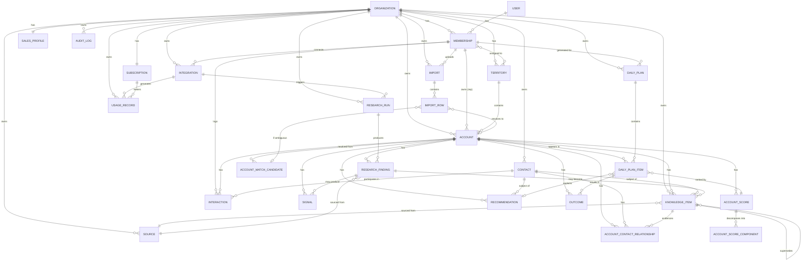

# Data Model

PostgreSQL is authoritative. Embeddings (pgvector) support retrieval;
they are never the source of truth for a fact — see
`AI_ARCHITECTURE.md`. Every tenant-owned table carries `organization_id`
directly (never only through a multi-hop join) so row-level security
policies stay simple and auditable — see `SECURITY.md`.

## ERD



## Entities

### Organization
The tenant boundary. `id, name, slug, industry, created_at, updated_at,
deleted_at`. Everything else hangs off this, directly or transitively.

### User / Membership
`User` maps 1:1 to a Supabase Auth identity (`auth_user_id`) plus
profile fields (`email, full_name`). `Membership` is the join between
`User` and `Organization`, carrying `role` (`OWNER | ADMIN | MANAGER |
REP`), optional territory assignment, `status` (active/invited/
removed), `created_at`. **A user's authorization is always resolved
through Membership, never through User directly** — see `SECURITY.md`.

### Territory
Optional grouping (`id, organization_id, name, description`) used for
manager-visibility scoping. V1 keeps this simple — a Membership can be
associated with zero or more Territories; an Account belongs to at most
one. Do not over-build hierarchical territory trees in V1.

### SalesProfile
Effectively one row per Organization (versioned via `updated_at` +
history in `AuditLog`, not a separate version table in V1):
`what_we_sell, value_props, icp JSONB, deal_size_min, deal_size_max,
sales_cycle_days, common_buyer_titles JSONB, common_influencer_titles
JSONB, common_champion_titles JSONB, common_objections JSONB,
disqualifiers JSONB, strategic_priorities JSONB`. This is read by
scoring (`AccountScoreComponent` "ICP Fit") and by research
(`RESEARCH_ARCHITECTURE.md`) to decide what evidence matters.

### Account
`id, organization_id, name, normalized_name, primary_domain, industry,
employee_count_range, address JSONB, territory_id, owner_membership_id,
status (active/inactive/merged), merged_into_account_id, created_at,
updated_at`. `normalized_name`/`primary_domain` are the deterministic
half of entity resolution (see below).

### AccountMatchCandidate
Entity-resolution review queue. `id, organization_id, raw_name,
raw_domain, raw_source (import_row/enrichment/crm), candidate_account_id,
match_confidence, match_method (deterministic_domain/normalized_name/
fuzzy/ai_assisted), status (PENDING | CONFIRMED | REJECTED |
AUTO_MERGED), reviewed_by_membership_id, reviewed_at, created_at`. See
"Entity Resolution" below — ambiguous matches never silently merge.

### Contact
`id, organization_id, account_id, first_name, last_name, title, email,
phone, linkedin_url (reference only, never scraped — see
INTEGRATIONS.md), status (active/departed/unknown), created_at,
updated_at`.

### AccountContactRelationship
This is where role hypotheses live, deliberately separated from the
raw `Contact` record because a contact's *role in the buying
committee* is knowledge with provenance, not a fixed attribute: `id,
account_id, contact_id, role_hypothesis (decision_maker/influencer/
champion/blocker/unknown), certainty_type (KNOWN | INFERRED |
SUGGESTED), is_current, valid_from, valid_until, source_knowledge_item_id,
created_at`. Multiple rows can exist for the same account+contact over
time — old hypotheses aren't deleted when superseded, they're closed
out via `valid_until` and a new row references the old one implicitly
through time overlap.

### Interaction
Logged sales activity: `id, organization_id, account_id, contact_id,
membership_id, type (call/email/meeting/note), occurred_at, summary,
source (manual/import/crm_sync), external_ref, created_at`. Interactions
are a specific, narrower thing than `KnowledgeItem` — an Interaction is
"this event happened"; a `KnowledgeItem` derived from it ("Sarah
handles purchasing") is a fact extracted from it. Not every Interaction
produces a KnowledgeItem, and not every KnowledgeItem originates from
an Interaction (many come from research or import).

### KnowledgeItem — the institutional-memory core

This is the entity the whole product depends on getting right; see
`PRODUCT_CONSTITUTION.md` on why a single `account.notes` text field
was rejected. Fields:

```
id, organization_id, account_id, contact_id (nullable),
type (note/call_note/crm_activity/meeting_observation/
  decision_maker/contract_timing/incumbent_vendor/relationship/
  objection/historical_event/research_finding/announcement/
  inferred_observation),
content (text),
structured_value (JSONB, nullable — e.g. {"incumbent_vendor": "Ricoh"}),
origin (user_entered/imported/crm_synced/research_derived/ai_inferred),
source_id (FK -> Source),
source_reference (e.g. CRM record id),
source_url (nullable),
created_by (FK -> Membership, nullable if machine-originated),
observed_at (when the fact was true/noted in the real world),
imported_at (when it entered Scout, if different from observed_at),
valid_from, valid_until (nullable — open-ended if still believed current),
confidence (numeric 0-1),
certainty_type (KNOWN | INFERRED | SUGGESTED),
verification_status (CURRENT | STALE | SUPERSEDED | CONFLICTING | UNVERIFIED),
supersedes (FK -> KnowledgeItem, nullable),
created_at, updated_at
```

**Non-negotiable rule**: no code path deletes a KnowledgeItem to
"clean up" conflicting or outdated information. A new, more current
item gets created with `supersedes` pointing at the old one, and the
old item's `verification_status` moves to `SUPERSEDED` — it stays
queryable for history/explainability (see §23 of the source brief:
"Scout should not simply delete the 2019 note"). `CONFLICTING` status
is used when two *current* items disagree and neither clearly
supersedes the other — the product surfaces the conflict rather than
picking a winner algorithmically.

### Source
`id, organization_id, type (user/import/crm/enrichment/web/
ai_inference), name, url (nullable), reliability_weight (numeric,
used in scoring), created_at`. Every `KnowledgeItem` and
`ResearchFinding` references a `Source` — this is what makes "why is
Scout telling me this" answerable (see `AI_ARCHITECTURE.md`
§Explainability).

### Import / ImportRow
`Import`: `id, organization_id, membership_id, file_name, file_type
(csv/xlsx), status (uploaded/mapping/processing/completed/failed),
column_mapping (JSONB), row_count, error_count, created_at,
completed_at`. `ImportRow`: `id, import_id, row_number, raw_data
(JSONB), resolution_status (matched/ambiguous/new/error),
matched_account_id (nullable), match_candidate_id (nullable FK ->
AccountMatchCandidate), error (nullable), created_at`. Row-level
granularity means a bad row never blocks the rest of an import, and
gives the entity-resolution review queue something concrete to point
at.

### Integration
`id, organization_id, provider_type (crm/enrichment/research),
provider_name, status (connected/disconnected/error), credentials_ref
(reference into a secrets store — never the raw credential in this
table, see `SECURITY.md`), connected_by_membership_id, connected_at,
last_synced_at, config (JSONB)`.

### ResearchRun / ResearchFinding / Signal
`ResearchRun`: `id, organization_id, account_id, trigger_type
(manual/scheduled/import_triggered), status (queued/running/completed/
failed), started_at, completed_at, cost_cents, provider_calls (JSONB
log of which providers were hit)`. `ResearchFinding`: `id,
organization_id, account_id, research_run_id, source_id, finding_type,
content, structured_value (JSONB), url, retrieved_at, relevant_date
(nullable — the date the underlying event happened, vs. retrieved_at
which is when Scout found it), confidence, certainty_type, created_at`.
`Signal`: `id, organization_id, account_id, signal_type (expansion/
leadership_change/funding/hiring/tech_change/filing/other),
detected_at, strength (numeric), research_finding_id, created_at`. A
`Signal` is a `ResearchFinding` that's been classified as
prioritization-relevant — not every finding is a signal.

### AccountScore / AccountScoreComponent
`AccountScore`: `id, organization_id, account_id, total_score,
computed_at, model_version, explanation_summary`. `AccountScoreComponent`:
`id, account_score_id, component_type (icp_fit/timing/relationship/
signal_strength/historical_context/data_confidence/strategic_priority),
points, max_points, evidence_refs (JSONB array of KnowledgeItem/
ResearchFinding/Signal ids)`. The exact scoring formula is deferred
(see `ROADMAP.md`/`DECISIONS.md`) — what's architecturally fixed is
that a score is never stored without its components, and components
always carry evidence references back to real rows, not free text.

### DailyPlan / DailyPlanItem / Recommendation / Outcome
`DailyPlan`: `id, organization_id, membership_id, plan_date, status
(generating/ready/stale), generated_at`. `DailyPlanItem`: `id,
daily_plan_id, account_id, rank, tier (call_first/worth_contacting/
nurture/low_priority), account_score_id, recommendation_id`.
`Recommendation`: `id, organization_id, account_id, contact_id
(nullable), headline, reasoning (text), evidence_refs (JSONB),
confidence, generated_at, model_version`. `Outcome`: `id,
organization_id, daily_plan_item_id (nullable), account_id,
membership_id, outcome_type (contacted/meeting_booked/no_response/
skipped/deferred), occurred_at, notes`. `Outcome` closes the loop —
it's what eventually lets scoring get evaluated against reality
instead of staying a static formula forever (explicitly deferred past
V1, but the table exists from day one so history isn't lost waiting
for that feature).

### UsageRecord / Subscription
`UsageRecord`: `id, organization_id, usage_type (research_run/ai_call/
enrichment_credit/storage_mb/job_execution), quantity, unit_cost_cents,
occurred_at, related_id (polymorphic reference)`. `Subscription`: `id,
organization_id, stripe_customer_id, stripe_subscription_id, plan,
status, seats, current_period_end`. See `COST_MODEL.md`.

### AuditLog
`id, organization_id, actor_membership_id (nullable — system actions
have none), action, target_type, target_id, metadata (JSONB),
created_at`. Append-only, never updated or deleted by application
code.

## Entity resolution

Imports and enrichment will produce near-duplicate company references
("ABC Inc." / "ABC Incorporated" / "abc.com"). Resolution order:

1. **Deterministic domain match** — normalized primary domain equality.
   Highest confidence, auto-applied.
2. **Normalized-name match** (case/punctuation/legal-suffix-insensitive)
   combined with a secondary signal (address, CRM ID, enrichment ID) —
   auto-applied only when at least two signals agree.
3. **Fuzzy match** (name similarity alone, or a single weak signal) —
   never auto-applied. Creates an `AccountMatchCandidate` row in
   `PENDING` status for human review.
4. **AI-assisted match** (LLM judges likely-same-entity from combined
   context) — same rule as fuzzy: assists ranking of candidates shown
   to a human, never auto-merges on its own.

**No silent merges below full deterministic confidence.** A wrong
auto-merge corrupts institutional memory in a way that's hard to
detect later — this is a case where the CTO/security council role
overruled a "just use AI to match everything" shortcut (see
`docs/COUNCIL_REVIEW.md`).

## Embeddings

`pgvector` stores embeddings for `KnowledgeItem` and `ResearchFinding`
content, keyed back to the source row's primary key. Embeddings exist
to power semantic retrieval (e.g. "find everything Scout knows that's
relevant to this account's timing") — they are a derived index, never
queried as ground truth, and are fully rebuildable from the relational
data at any time. If the vector index is lost, nothing about the
business is lost — that's the test for whether something belongs in
pgvector vs. Postgres proper.

## What's deferred, on purpose

Territory hierarchies beyond one level, SalesProfile versioning as a
first-class history table (relying on `AuditLog` for now), a formal
scoring-weight-tuning system, self-serve entity-resolution rule
authoring. See `ROADMAP.md` and `DECISIONS.md`.

---

# Phase 2 Additions

Adds the entities the commercial product spec (`TARGET_LISTS.md`,
`SELLER_STYLE.md`, `POST_CALL_WORKFLOW.md`, `PROSPECTING_ANALYTICS.md`)
depends on. Implemented in `supabase/migrations/0002_core_product.sql`
— this is also the migration that finally creates `Account`, `Contact`,
`KnowledgeItem`, etc. from the Phase 1 design above; nothing beyond
tenancy tables existed in the database until now (see
`supabase/README.md`).

## ADR note: TargetList supersedes DailyPlan as the primary workspace object

Phase 1 designed `DailyPlan`/`DailyPlanItem` as a single-day ranked
list. The Phase 2 product spec makes **Target Lists** — persistent,
multi-day, named prospecting workspaces — the central object instead
("a rep works Construction Monday, Law Firms Tuesday, returns to
Construction Wednesday exactly where they left off"). `DailyPlan`
doesn't model that; a list a rep works over two weeks isn't "today's
plan." Recorded as `ADR-0006` in `DECISIONS.md`: `TargetList` +
`TargetListItem` replace `DailyPlan`/`DailyPlanItem` as the primary
workspace; `AccountScore`/`Recommendation` (Phase 1) remain and now
feed a Target List's "Suggested Calls" ordering instead of a daily
plan. The `daily_plan`/`daily_plan_item` tables are dropped from the
schema before ever being used in production — no migration/data
concern, they were never populated.

## New / changed entities

### TargetList

The persistent prospecting workspace. `id, organization_id, name,
description, owner_membership_id, created_by_membership_id,
research_focus (nullable text — e.g. "Cybersecurity"), vertical,
geography, status (active/archived), created_at, last_worked_at`.
**Never expires rep progress** — see `TargetListItem`.

### TargetListItem

One account's position within one list. `id, target_list_id,
account_id, status (not_started/in_progress/worked/skipped), pinned
(boolean), position (for manual ordering, nullable — default order is
computed from AccountScore, not stored), worked_at, added_at`. A
account can belong to multiple TargetLists (e.g. shows up in both
"Existing Customers" and "Cybersecurity" lists) — this is a many-to-
many via TargetListItem, not a foreign key on Account.

### ContractInfo

Historical contract/incumbent timing, split out from generic
`KnowledgeItem` because it has a distinct, queryable shape used by
scoring ("Timing" component) and the brief's "What Your Team Knows"
section. `id, organization_id, account_id, incumbent_vendor,
contract_start_date, contract_end_date, lease_end_date,
certainty_type (KNOWN/INFERRED/SUGGESTED), source_knowledge_item_id,
created_at, updated_at`. Multiple rows per account allowed (renewal
history) — most recent `contract_end_date` is "current" by convention,
not a special flag.

### SellerStyleProfile

Persistent per-rep communication style — explicitly **not** the same
memory category as Account Brain (see `SELLER_STYLE.md`). `id,
organization_id, membership_id, sample_scripts (jsonb array),
sample_emails (jsonb array), sample_voicemails (jsonb array), tone_notes
(text — free-form prefs like "direct, no buzzwords"), updated_at`. One
row per Membership. Organization-level `SalesProfile` (Phase 1) can
optionally constrain style with `approved_language`/`compliance_rules`
— rep style is the default; org constraints are opt-in, not the norm
(see product spec §29).

### CallOutcome

Supersedes Phase 1's generic `Outcome` table — same purpose, now
explicitly tied to `TargetListItem` instead of the retired
`DailyPlanItem`, and the outcome taxonomy matches the product spec.
`id, organization_id, account_id, target_list_item_id (nullable — a
call can happen outside any list), contact_id (nullable),
membership_id, outcome_type (no_answer/voicemail/gatekeeper/
general_staff/influencer/champion/decision_maker/other_executive/
wrong_contact/not_interested/connected/meeting_booked/
follow_up_required), contact_role_observed (free text — "Linda at
reception"), occurred_at, created_at`. Logging must be fast — this
table has no required fields beyond outcome_type + account_id.

### SellingSituationDefinition

Org-configurable qualification criteria — explicitly not a hardcoded
MEDDPICC implementation (product spec §56). `id, organization_id,
name, criteria (text — e.g. "Is it a deal? Is it a deal I can get? Is
it a deal I can get this month?"), is_default, created_by_membership_id,
created_at`. One org can have multiple definitions (different teams,
different qualification bars).

### SellingSituation

The recorded instance of a qualified opportunity-in-formation. `id,
organization_id, account_id, definition_id, created_from_call_outcome_id
(nullable), created_by_membership_id, created_at, notes`. Deliberately
lightweight — Scout does not replace the CRM's Opportunity object (see
`CRM_WRITEBACK.md` system-of-record rule); this is the analytics-and-
handoff marker, not a deal-management record.

### PostCallNote

The post-call assistant's working record. `id, organization_id,
account_id, call_outcome_id, membership_id, raw_input (text — the
rep's messy dictated/typed note), clean_note (text — Scout's cleaned
version), proposed_account_updates (jsonb — candidate KnowledgeItem/
AccountContactRelationship changes, certainty_type always INFERRED or
SUGGESTED until approved), follow_up_email_draft (text), approved_at,
approved_by_membership_id, crm_write_status (not_applicable/pending/
written/failed), created_at`. Nothing in `proposed_account_updates`
becomes a real `KnowledgeItem` until `approved_at` is set — see
`POST_CALL_WORKFLOW.md`.

### AnalyticsEvent

Event-sourced record backing every funnel/rate calculation in
`PROSPECTING_ANALYTICS.md` — chosen specifically so every displayed
rate has a real, recomputable denominator instead of a maintained
counter that can drift. `id, organization_id, event_type
(call_attempted/conversation/target_conversation/meeting_booked/
selling_situation_created/opportunity_created/email_drafted/
email_sent/crm_note_created/contact_added/account_worked),
account_id (nullable), target_list_id (nullable), contact_id
(nullable), membership_id (nullable), metadata (jsonb), occurred_at,
created_at`. Funnel rates are computed by counting events, never
stored as a pre-aggregated percentage.

### Platform admin flag (on `app_users`)

Adds `platform_admin (boolean, default false)` to the Phase 1
`app_users` table — a *platform-level* flag, deliberately separate
from the org-scoped `Membership.role` enum, because the Founder
Operations Console (`FOUNDER_OPERATIONS.md`) needs cross-organization
access that no org-scoped role should ever grant. See `SECURITY.md`
update: this flag requires the same dual-layer (app-check + RLS)
discipline as everything else, and every read it authorizes is
audit-logged.

### Organization fields added

`first_value_at (timestamptz, nullable)` — set once, never cleared,
per `CUSTOMER_IMPLEMENTATION.md`'s First Value criteria.
`relationship_status` is added to **Account**, not Organization:
`prospect | current_customer | former_customer | partner | unknown`.

## Competitor/incumbent memory — a query, not a table

Product spec §33 describes surfacing patterns like "8 historical notes
mention Competitor X had slow service communication." This is **not**
a new persisted entity — it's an aggregation query over existing
`KnowledgeItem` rows (`type = 'incumbent_vendor'` or `'objection'`,
grouped by `structured_value->>'competitor_name'`), scoped by
`organization_id` (never cross-tenant — see product spec §33's
explicit leakage warning). Adding a dedicated table before there's
evidence the aggregation needs to be pre-computed would be exactly the
"table that might be useful someday" anti-pattern this doc otherwise
rejects.

## Customer health — computed, not stored

Product spec §87 explicitly rejects "complex predictive churn
algorithms." Health status (`Healthy`/`Needs Attention`/`At Risk`) is
computed on read in the Founder Operations Console from existing
signals (days since last login, days since last research, days since
last `AnalyticsEvent`, integration connection status) — not written to
a table on a schedule. If read-time computation ever becomes a real
performance problem, a snapshot table is a cheap addition later;
building it now would be premature.
